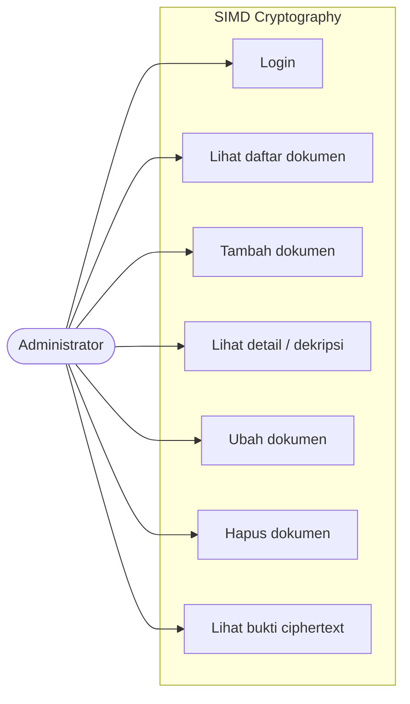
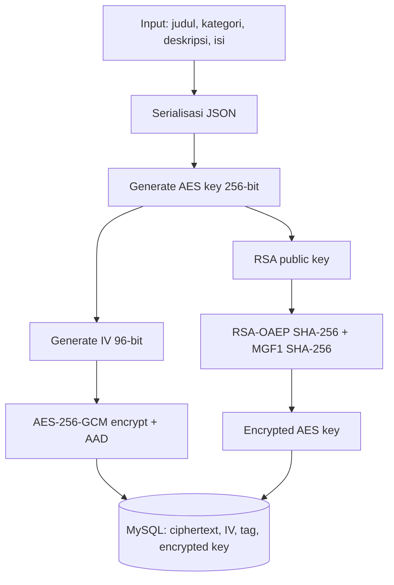
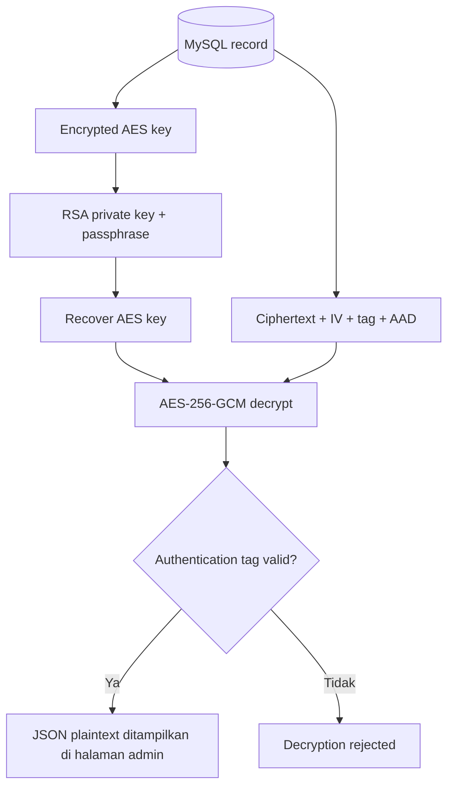

# Diagram Perancangan SIMD Cryptography

## Use case administrator

```mermaid
flowchart LR
    Admin([Administrator])
    subgraph SIMD[SIMD Cryptography]
        Login[Login]
        List[Lihat daftar dokumen]
        Create[Tambah dokumen]
        Detail[Lihat detail / dekripsi]
        Update[Ubah dokumen]
        Delete[Hapus dokumen]
        Cipher[Lihat bukti ciphertext]
    end
    Admin --> Login
    Admin --> List
    Admin --> Create
    Admin --> Detail
    Admin --> Update
    Admin --> Delete
    Admin --> Cipher
```

## Hybrid encryption

```mermaid
flowchart TD
    A[Input: judul, kategori, deskripsi, isi] --> B[Serialisasi JSON]
    B --> C[Generate AES key 256-bit]
    C --> D[Generate IV 96-bit]
    D --> E[AES-256-GCM encrypt + AAD]
    C --> F[RSA public key]
    F --> G[RSA-OAEP SHA-256 + MGF1 SHA-256]
    G --> H[Encrypted AES key]
    E --> I[(MySQL: ciphertext, IV, tag, encrypted key)]
    H --> I
```

## Decryption

```mermaid
flowchart TD
    A[(MySQL record)] --> B[Encrypted AES key]
    B --> C[RSA private key + passphrase]
    C --> D[Recover AES key]
    A --> E[Ciphertext + IV + tag + AAD]
    D --> F[AES-256-GCM decrypt]
    E --> F
    F --> G{Authentication tag valid?}
    G -->|Ya| H[JSON plaintext ditampilkan di halaman admin]
    G -->|Tidak| I[Decryption rejected]
```
